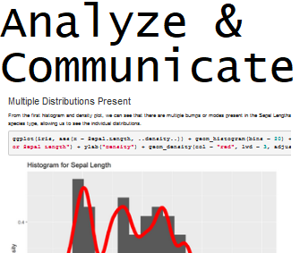
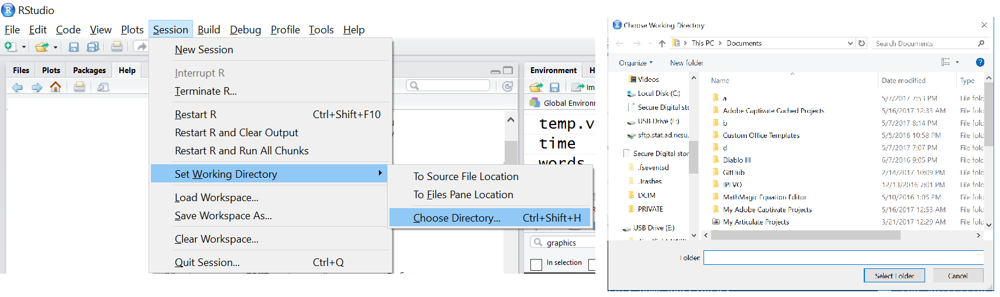

layout: true

<div class="my-footer"></div> 

---

```{r setup, include=FALSE,warning=FALSE,message=FALSE}
options(htmltools.dir.version = FALSE)
knitr::opts_chunk$set(
  message = FALSE,
  warning = FALSE,
  dev = "svg",
  fig.align = "center"
  #fig.width = 11,
  #fig.height = 5
)

# define vars
om = par("mar")
lowtop = c(om[1],om[2],0.1,om[4])
library(tidyverse)
library(knitr)
options(dplyr.print_min = 5)
```


layout: false
class: title-slide-section-red, middle

# Overview & R Markdown
Justin Post

---
layout: true

<div class="my-footer"></div> 

---


# What is this course about?

Basic use of R for reading, manipulating, and summarizing data.  With a focus on reproducibility!

---

# What is this course about?

Basic use of R for reading, manipulating, and summarizing data.  With a focus on reproducibility!


<div style = "float: left;border:1px solid black;">
```{r, fig.align = 'left', out.width = '205px', out.height = "249px", echo = FALSE}
knitr::include_graphics("img/rawData.png")
```
</a>
</div>
<div style = "float: left;">
```{r, fig.align = 'left', out.width = '30px', out.height = "249px", echo = FALSE}
knitr::include_graphics("img/arrow.png")
```
</div>
<div style = "float: left;border:1px solid black;">
```{r, fig.align = 'left', out.width = '205px', out.height = "249px", echo = FALSE}
knitr::include_graphics("img/ImportR.png")
```
</a>
</div>
<div style = "float: left;">
```{r, fig.align = 'left', out.width = '30px', out.height = "249px", echo = FALSE}
knitr::include_graphics("img/arrow.png")
```
</div>
<div style = "float: left;border:1px solid black;">
```{r, fig.align = 'left', out.width = '205px', out.height = "249px", echo = FALSE}
knitr::include_graphics("img/SummarizeR.png")
```
</a>
</div>
<div style = "float: left;">
```{r, fig.align = 'left', out.width = '30px', out.height = "249px", echo = FALSE}
knitr::include_graphics("img/arrow.png")
```
</div>
<div style = "float: left;border:1px dashed black;">
```{r, fig.align = 'left', out.width = '205px', out.height = "249px", echo = FALSE}

```
</div>


---

# What is this course about?

Basic use of R for reading, manipulating, and summarizing data.  With a focus on reproducibility!


<div style = "float: left;border:1px solid black;">
```{r, fig.align = 'left', out.width = '205px', out.height = "249px", echo = FALSE}
knitr::include_graphics("img/rawData.png")
```
</a>
</div>
<div style = "float: left;">
```{r, fig.align = 'left', out.width = '30px', out.height = "249px", echo = FALSE}
knitr::include_graphics("img/arrow.png")
```
</div>
<div style = "float: left;border:1px solid black;">
```{r, fig.align = 'left', out.width = '205px', out.height = "249px", echo = FALSE}
knitr::include_graphics("img/ImportR.png")
```
</a>
</div>
<div style = "float: left;">
```{r, fig.align = 'left', out.width = '30px', out.height = "249px", echo = FALSE}
knitr::include_graphics("img/arrow.png")
```
</div>
<div style = "float: left;border:1px solid black;">
```{r, fig.align = 'left', out.width = '205px', out.height = "249px", echo = FALSE}
knitr::include_graphics("img/SummarizeR.png")
```
</a>
</div>
<div style = "float: left;">
```{r, fig.align = 'left', out.width = '30px', out.height = "249px", echo = FALSE}
knitr::include_graphics("img/arrow.png")
```
</div>
<div style = "float: left;border:1px dashed black;">
```{r, fig.align = 'left', out.width = '205px', out.height = "249px", echo = FALSE}

```
</div>
<div style = "content:'';clear: both;display: table;">
</div>

[Start with an example!](https://jbpost2.github.io/R4Reproducibility/slides/QuickIntroMarkdown.Rmd)

---

# First Part of Course 


```{r, out.width='7%', echo = FALSE}
include_graphics("img/R.png")
```
```{r, out.width='7%', echo = FALSE}
include_graphics("img/RStudio.png")
```

- Learn basics of R Markdown for literate programming

- Understand how R stores data 

- Read external data into R


---

# RStudio IDE 

In RStudio, four main locations (easy to customize!)   

- Console (& Terminal)  
    
- Files/Plots/Packages/Help

- Environment (& Connections/Git)  

- Scripting and Viewing Window  

```{r, out.width="450px", echo = FALSE }
include_graphics("img/RStudioSnip.png")
```


---

#  Console  

- Type code directly into the **console** for evaluation  

<div style = "float:left; width = 45%;">
```{r calc2, echo=TRUE}
#simple math operations
# <-- is a comment - code not evaluated
3 + 7
10 * exp(3) #exp is exponential function
log(pi^2) #log is natural log by default
```
</div>
<div style = "float: left; width = 10%;">
&nbsp;&nbsp;&nbsp;&nbsp;&nbsp;&nbsp;&nbsp;&nbsp;&nbsp;&nbsp;&nbsp;&nbsp;&nbsp;&nbsp;&nbsp;&nbsp;&nbsp;&nbsp;&nbsp;&nbsp;&nbsp;&nbsp;
</div>
<div style = "float:left; width = 45%;">
```{r basic, echo = TRUE, out.width = "250px", fig.align='center'}
mean(cars$speed)
hist(cars$speed)
```
</div>
<!--Needed so the above renders correctly.  Why, who knows? -->


---

#  Files/Plots/Packages/Help 

- Files (navigate through files)

- Created plots stored in `Plots` tab  

    - Cycle through past plots  
    - Easily save  

- Packages (update and install)
    
- Documentation within RStudio via 
`help(...)` 

    + Ex: `help(seq)`  


---

#  Files/Plots/Packages/Help 

<div style = "float:left;">
- Files (navigate through files)

- Created plots stored in `Plots` tab  

    - Cycle through past plots  
    - Easily save  

- Packages (update and install)
    
- Documentation within RStudio via 
`help(...)` 

    + Ex: `help(seq)`  
</div>
<div style = "float:left;">
```{r, echo = FALSE, out.width = "450px"}

```
</div>
<!--comment to fix-->


---

#  Files/Plots/Packages/Help 

<div style = "float:left;">
- Files (navigate through files)

- Created plots stored in `Plots` tab  

    - Cycle through past plots  
    - Easily save  

- Packages (update and install)
    
- Documentation within RStudio via 
`help(...)` 

    + Ex: `help(seq)`  
</div>
<div style = "float:left;">
```{r, echo = FALSE, out.width = "450px"}

```
</div>
<!--comment to fix-->


---

#  Environment   

- We store **data/info/function/etc.** in R objects  

- Create an R object via `<-` (recommended) or `=`  

```{r save,echo=TRUE}
#save for later
avg <- (5 + 7 + 6) / 3
#call avg object
avg
#strings (text) can be saved as well
words <- c("Hello there!", "How are you?")
words
```


---

#  Environment   

- Built-in objects exist like `letters` and `cars` don't show automatically

```{r builtin, echo = TRUE}
letters
head(cars, n = 3)
```

- `data()` shows available built-in data sets


---

#  Scripting and Viewing Window 


<div style = "float:left;">
- Usually want to keep code for later use!  

- Traditionally code in a 'script' and save script

    + Instead we'll use R Markdown
    + A file with extension `.Rmd`

- Let's start with R Markdown!
</div>
<div style = "float:left;">
```{r, fig.cap = "http://applied-r.com/", echo = FALSE, out.width = "300px"}
knitr::include_graphics("img/rmarkdown_workflow.png")
```
</div>
<!--comment to fix-->


---
  
# Documenting with Markdown  
  
Designed to be used in three ways ([R for Data Science](https://r4ds.had.co.nz/))  

- Communicating to decision makers (focus on conclusions not code)  
  
- Collaborating with other data scientists (including future you!)  
  
- As environment to do data science (documents what you did and what you were thinking)  

  
---
  
# Markdown Languages
  
- May have heard of HTML (HyperText Mark-up Language)  

    + Write plain text with *tags* that the browser interprets and renders  

  
---
  
# Markdown Languages
  
- May have heard of HTML (HyperText Mark-up Language)  

    + Write plain text with *tags* that the browser interprets and renders  

- R Markdown is a specific markup language  

    + Easier syntax  
    + Not as powerful  

- Any plain text file can be used (`.Rmd` extension associates it with R Studio)

---
  
# Markdown Languages
  
- May have heard of HTML (HyperText Mark-up Language)  

    + Write plain text with *tags* that the browser interprets and renders  

- R Markdown is a specific markup language  

    + Easier syntax  
    + Not as powerful  

- Any plain text file can be used (`.Rmd` extension associates it with R Studio)

- Easy to create many types of documents in R Markdown!
```{r, echo = FALSE, fig.align='center', out.width = '600px'}
knitr::include_graphics("img/compile.png")
```

---
  
# Creating an R Markdown Document
  
- R Studio makes it easy!  
  
```{r startMD.png, out.width = "550px",echo=FALSE, fig.align='center'}
knitr::include_graphics("img/startMD.png")
```


---

# Choosing the Output Type
  
- Many commonly used document types can be created 

```{r startMDDoc.png, out.width = "400px",echo=FALSE, fig.align='center'}
knitr::include_graphics("img/startMDDoc.png")
```


---

# `.Rmd` Files

R Markdown files (`.Rmd`) contain three important types of content:
  
1. (Optional) YAML header surrounded by `---`s  

    + Defines meta data about the document

2. Chunks of R code   

    + Code that may evaluate and produce output when *knitting* the document

3. Text mixed with simple text formatting instructions (R Markdown syntax)


---

# YAML Header
  
- Defines settings for the creation process

```
---
title: "Untitled"
author: "First Last"
date: "xxxx"
output: html_document
---
```  

- CTRL/CMD + Shift + k or the **Knit** button creates a document via this info 

- [Great examples of options here](https://bookdown.org/yihui/rmarkdown/html-document.html)


---
  
# Creating PDF Output

Change the `output` to `pdf_document`

- If you have a `Tex` engine on their computer (such as `MikTex`), good to go

- If not, easiest to do the following first:

    1. Install the `tinytex` package  
    
    2. Run `library(tinytex)`
    
    3. Run `install_tinytex()`
    
    4. Restart R 


---


# Markdown Syntax

- `# R Markdown` $\rightarrow$ First level header

- `## Next` $\rightarrow$ Second level header


---


# Markdown Syntax

- `# R Markdown` $\rightarrow$ First level header

- `## Next` $\rightarrow$ Second level header

- `<http://rmarkdown.rstudio.com>` $\rightarrow$ A hyperlink: <http://rmarkdown.rstudio.com>

- `[Cheat Sheet link](https://www.rstudio.com/wp-content/uploads/2015/03/rmarkdown-reference.pdf)` $\rightarrow$ [Cheat Sheet link](https://www.rstudio.com/wp-content/uploads/2015/03/rmarkdown-reference.pdf)  


---


# Markdown Syntax

- `# R Markdown` $\rightarrow$ First level header

- `## Next` $\rightarrow$ Second level header

- `<http://rmarkdown.rstudio.com>` $\rightarrow$ A hyperlink: <http://rmarkdown.rstudio.com>

- `[Cheat Sheet link](https://www.rstudio.com/wp-content/uploads/2015/03/rmarkdown-reference.pdf)` $\rightarrow$ [Cheat Sheet link](https://www.rstudio.com/wp-content/uploads/2015/03/rmarkdown-reference.pdf)  

- `**Knit**` or `__Knit__` $\rightarrow$ Bold font (**Knit**)

- `*italic*` or `_italic_` $\rightarrow$ Italic font (*italic*)

- `*__both__*` $\rightarrow$ Bold and italic (*__both__*)

---
  
# Markdown Syntax 
  
- Can do lists (be careful with spaces & returns)  
  
    + Indent sub lists four spaces  

<div style = "float: left; width: 50%">
<br>
```
- unordered list  
- item 2  
    + sub-item 1  
    + sub-item 2  

1. ordered list  
2. item 2  
    a. sub-item 1  
    b. sub-item 2  
```  
</div>
<div style = "float: right; width: 50%">
- unordered list  
- item 2  
    + sub-item 1  
    + sub-item 2  

1. ordered list  
2. item 2  
    a. sub-item 1  
    b. sub-item 2  
</div>
<!--Float-->
<br><br>
- See the cheatsheet [here](https://raw.githubusercontent.com/rstudio/cheatsheets/main/rmarkdown.pdf) or [here](https://github.com/jbpost2/R4Reproducibility/blob/main/cheatsheets/rmarkdown-reference.pdf)
  
---

# Code Chunks

```{r chunk_png, out.width = "500px",echo=FALSE, fig.align='center'}
knitr::include_graphics("img/chunk.png")
``` 

---

# Code Chunks

```{r, out.width = "500px",echo=FALSE, fig.align='center'}
knitr::include_graphics("img/chunk.png")
```  

- Start code chunk by typing out the syntax or with CTRL/CMD + Alt/Option + I

- Can execute code in RStudio as you are writing

- Code is executed sequentially when document is created


---

# Code Chunks
  

```{r, out.width = "500px",echo=FALSE, fig.align='center'}
knitr::include_graphics("img/chunk.png")
```

Can specify behavior of each code chunks via **global** or **local** chunk options:
  
- Hide/show code: `echo = FALSE/TRUE`  

- `eval = TRUE/FALSE`   

- Eval, not show code or output: `include = TRUE/FALSE` 

- `message = TRUE/FALSE` and `warning = TRUE/FALSE`


---

# Code Chunks
  
```{r, out.width = "500px",echo=FALSE, fig.align='center'}
knitr::include_graphics("img/chunk.png")
```

Global chunk options:

- Usually have a **setup** code chunk (with `include = FALSE`) 

- Defines global behavior for all chunks  

Ex: `opts_chunk$set(echo = FALSE, eval = TRUE, warning = FALSE)`


---

# Code Chunks
  
```{r, echo = TRUE, eval = FALSE}
knitr::include_graphics("img/chunk.png")
```

Using chunks is generally the best way to include an image.  

Code chunk options often used

- `fig.align = 'center'`

- `out.width = "500px"`

- `echo = FALSE`


---

# Inline R Code

R code can be evaluated inline!  

- Begin with a single back-tick followed by `r`

- End with another back-tick

Ex: Iris has `r` `length(iris[ ,1])` observations $\rightarrow$ Iris has `r length(iris$Sepal.Length)` observations


---

# Recap!  

- R Markdown allows for easily reproducible analyses and documenting of thought processes  

    + YAML header
    + Plain text with R Markdown syntax
    + Code chunks

- [Cheat Sheet link](https://www.rstudio.com/wp-content/uploads/2015/03/rmarkdown-reference.pdf) great for getting started  

- Everything you could want to know about R Markdown in [R Markdown: The Definitive Guide](https://bookdown.org/yihui/rmarkdown/)


---

# Let's Practice

- Take the raw text [here](https://raw.githubusercontent.com/jbpost2/R4Reproducibility/main/exercises/raw.txt)
- Create the HTML output [here](https://jbpost2.github.io/R4Reproducibility/exercises/Markdown.html)

Guidance:
- Create a new .Rmd file and replace its test with the raw text (copy/paste)
- Knit the document as is to start
- Add headers (the `dplyr`, `ggplot2`, `readr`, and `tidyr` sections are second level headers), reknit
- [Update YAML header](https://bookdown.org/yihui/rmarkdown/html-document.html) to add code folding, reknit 
- Update the global chunk options (`echo`, `eval` should be `TRUE`, `message` should be `FALSE`), reknit
- Modify local chunk options on the images to suppress code, reknit
- [Add in markdown syntax](https://github.com/jbpost2/R4Reproducibility/blob/main/cheatsheets/rmarkdown-reference.pdf) (links, code font, etc.), reknit
- [Add tabsets](https://bookdown.org/yihui/rmarkdown/html-document.html), reknit


---

layout: false
class: title-slide-section-red, middle

# Data Storage in R
Justin Post

---
layout: true

<div class="my-footer"></div> 


---

#  R Objects and Classes  

- Create an R object via `<-` (recommended) or `=`  

    + allocates memory to object  
    
```{r , echo = TRUE}
vec <- c(1, 4, 10)
vec
```

---

#  R Objects and Classes  

- Create an R object via `<-` (recommended) or `=`  

    + allocates memory to object  
    
```{r , echo = TRUE}
vec <- c(1, 4, 10)
vec
```

```{r , echo = TRUE}
fit <- lm(dist ~ speed, data = cars)
fit
```


---

#  Investigating Objects  

Many functions to help understand an R Object  

 - `str()`  
 
 - compactly displays the internal structure of an R object  
 
```{r obj1, echo = TRUE}
str(cars)
str(vec)
```


---

#  Data Objects   

- Understand data structures first: Five major types  

     + **Atomic Vector (1d)**  
     + Matrix (2d)  
     + Array (nd)  
     + **Data Frame (2d)**  
     + List (1d)  


Dimension | Homogeneous   | Heterogeneous
----------| ------------- | -------------
1d        | Atomic Vector | List
2d        | Matrix        | Data Frame
nd        | Array         |

---

#  Vector   

(Atomic) Vector (1D group of elements with an ordering)   

```{r vectorVis, echo = FALSE, fig.align='center', out.width = '650px', echo = FALSE}
knitr::include_graphics("img/vectorVisualF.png")
```

- Elements must be same 'type'  

    + numeric, character, or logical
    

---

#  Vector   

(Atomic) Vector (1D group of elements with an ordering)   
  - Create with `c()` function ('combine')  
```{r vecs}
#vectors (1 dimensional) objects
x <- c(17, 22, 1, 3, -3)
y <- c("cat", "dog", "bird", "frog")
x
y
```


---

#  Vector   

- Many **functions** output a numeric vector

```{r}
v <- seq(from = 1, to = 5, length = 5)
#same result with different inputs:
v <- seq(from = 1, to = 5, by = 1)
v
str(v)
```


---

#  `:` to Create a Sequence

```{r}
1:20 
```

- R does element-wise math on vectors

```{r seq5}
1:20/20
1:20 + 1
```


---

# Slicing Vectors

- Return elements using square brackets `[]`   


```{r}
letters #built-in vector
letters[1] #R starts counting at 1!
letters[26]
```


---

# Slicing Vectors

- Return elements using square brackets `[]`   

- Can 'feed' in a vector of indices to `[]`  

```{r indexVec2}
letters[1:4]
letters[c(5, 10, 15, 20, 25)]
x <- c(1, 2, 5)
letters[x]
```

---

# Slicing Vectors

- Return elements using square brackets `[]`   

- Can 'feed' in a vector of indices to `[]`  

- Use negative indices to return without  

```{r indexVec3}
letters[-(1:4)]
x <- c(1, 2, 5)
letters[-x]
```


---

# Building Blocks for Data Frames  

- Columns of a data frame are vectors

```{r dfVis, echo = FALSE, out.width = "500px", fig.align= 'center', echo = FALSE}
knitr::include_graphics("img/dfVisualF.png")
```


---

# Data Frame    

Data Frame (2D data structure)  

- Collection (list) of **vectors** of the same *length*  

- Create with `data.frame()` function  

```{r df1,echo=TRUE}
x <- c("a", "b", "c", "d", "e", "f")
y <- c(1, 3, 4, -1, 5, 6)
z <- 10:15
myDF <- data.frame(x, y, z)
myDF
```
<!--Like a more flexible matrix-->


---

# Data Frame    

Data Frame (2D data structure)

- Collection (list) of **vectors** of the same *length*  

- Create with `data.frame()` function

```{r df2,echo=TRUE,eval=TRUE}
myDF <- data.frame(char = x, data1 = y, data2 = z)
myDF
```
- char, data1, and data2 become the variable names for the data frame


---

# Slicing a Data Frame

- Use square brackets with a comma `[ , ]`

    + Index rows (prior to the comma) then columns (after the comma)

<div style="float: left; width: 45%;">
```{r matindex2}
myDF
myDF[c(2, 4), ]
```
</div>
<div style="float: right; width: 45%;">
```{r matindex3}
myDF[, 1]
myDF[2, ]
myDF[2, 1]
```
</div>
<!--Note that R simplifies the result where possible.  That is, returns an atomic vector if you have only 1 dimension and a matrix if two.  Also, if you only give a single value in the [] then R uses the count of the value in the matrix.  Counts go down columns first.-->

---

# Slicing a Data Frame

- Can use columns names to subset  

```{r dfindex2}
myDF[ , c("char", "data1")]
```


---

# Slicing a Data Frame

- Dollar sign allows easy access to a single column!  

```{r dfindex3}
myDF$char
myDF$data1
```


---

# Slicing a Data Frame

- Dollar sign allows easy access to a single column!  

- Most used method for accessing a single variable  

- RStudio fills in options.  
    + Type `mydf$`  
    + If no choices - hit tab
    + Hit tab again to choose  


---

# Recap!

Data Frame (2D data structure)
  
- Collection (list) of **vectors** of the same *length*

- Create with `data.frame()` function

- Access with `[ , ]` or `$`

- Perfect for most data sets!  

- Most functions that read 2D data store it as a `data frame` (or `tibble` - a special data frame covered shortly)  

---

# Let's Practice

We'll add to our `.Rmd` file from the previous activity

- Download the prompts to add to our markdown document [here](https://raw.githubusercontent.com/jbpost2/R4Reproducibility/main/exercises/RData.txt)

Guidance:
- Copy and paste the text from above into the bottom of the document, reknit
- Add to the code chunks, evaluating in the notebook
- Reknit occasionally to check the output


---

layout: false
class: title-slide-section-red, middle

# The `tidyverse`
Justin Post

---
layout: true

<div class="my-footer"></div> 

---


#  Where Do Our Objects & Functions Come From?

Dimension | Homogeneous   | Heterogeneous
----------| ------------- | -------------
1d        | Atomic Vector | List
2d        | Matrix        | Data Frame
nd        | Array         | 
<br> 

Basic access via
    <ul>
        <li> Atomic vectors - `x[ ]`</li>
        <li> Data Frames - `x[ , ]` or `x$name`</li>
        <li> Lists - `x[ ]`, `x[[ ]]`, or `x$name`</li>
    </ul>
    
    
---

#  Where Do Our Objects & Functions Come From?

When you open R a few `packages` are loaded
 
- R package:  

    + Collection of functions/objects/datasets/etc.

---


#  Where Do Our Objects & Functions Come From?

When you open R a few `packages` are loaded
 
- R package:  

    + Collection of functions/objects/datasets/etc.

- Packages exist to do almost anything
    + <a href = "https://cran.r-project.org/web/packages/available_packages_by_name.html">List of CRAN</a> approved packages
    + Plenty of other packages on places like GitHub

```{r, echo = FALSE, out.width='20%'}

```


---

#  Where Do Our Objects & Functions Come From?

- Packages loaded automatically
 
```{r loadR, fig.align = 'center', out.width = "200px", echo = FALSE}
include_graphics("img/loadR.PNG")
```

 - `base` package has `c()`, `data.frame()`, `list()`, ...
 
 
---

#  Base R vs Tidyverse  

- Everything done so far uses `Base R`  

Coherent and opinionated framework for common data tasks: 
- [`TidyVerse`](http://tidyverse.org/)

    + data importing (`readr`, `readxl`, `haven`, `DBI`)
    + data manipulation (`dplyr`, `tidyr`)
    + plotting (sort of) (`ggplot2`)
    + ...
    
    
---

#  Installing an R Package

- First time using a package  
    + Must **install package** (download files to your computer)  
    + Can use code, menus, or Packages tab

```{r, eval = FALSE}
install.packages("dplyr")
```

```{r install2, out.width = "500px",echo=FALSE, fig.align='center'}
knitr::include_graphics("img/packages.png")
```


---

#  Accessing a Package in Your R Session

- Only install once!  

- **Each session**: read in package using `library()` or `require()`

```{r}
library("dplyr")
```

---

#  Accessing a Package in Your R Session

- Only install once!  

- **Each session**: read in package using `library()` or `require()`

```{r libreq1}
library("dplyr")
```

- See everything from that package:
```{r}
ls("package:dplyr")
```


---

#  Calling From a Library 

- Call functions without loading full library with `::`  

- If not specified, most recently loaded package takes precedent

```{r readCSVex, eval = TRUE}
#stats::filter(...) calls time-series function from stats package
dplyr::filter(iris, Species == "virginica")
```

---

#  Reading Raw Data Into R

- Read in **raw** data using the `tidyverse` via `readr`, `readxl`, `haven`, and `DBI`


---

#  Reading Raw Data Into R

- Read in **raw** data using the `tidyverse` via `readr`, `readxl`, `haven`, and `DBI`

Plan:  

- Read 'clean' delimited data

- Read Excel data 

- See an example of connecting to a database


---

#  Reading Delimited Data

- Delimited data  

     + Delimiter - Character (such as a `,`) that separates data entries

<div style = "float: left;border:1px solid black;">
<a href = "https://www4.stat.ncsu.edu/~online/datasets/neuralgia.csv">
```{r csv, fig.align = 'left', out.width = '205px', out.height = "249px", eval = TRUE, echo = FALSE}
knitr::include_graphics("img/commaDelim.png")
```
</a>
</div>
<div style = "float: left;">
&nbsp;&nbsp;
</div>
<div style = "float: left;border:1px solid black;">
<a href = "https://www4.stat.ncsu.edu/~online/datasets/chemical.txt">
```{r space, fig.align = 'left', out.width = '205px', out.height = "249px", eval = TRUE, echo = FALSE}
knitr::include_graphics("img/spaceDelim.png")
```
</a>
</div>
<div style = "float: left;">
&nbsp;&nbsp;
</div>
<div style = "float: left;border:1px solid black;">
<a href = "https://www4.stat.ncsu.edu/~online/datasets/crabs.txt">
```{r tab, fig.align = 'left', out.width = '205px', out.height = "249px", eval = TRUE, echo = FALSE}
knitr::include_graphics("img/tabDelim.png")
```
</a>
</div>
<div style = "float: left;">
&nbsp;&nbsp;
</div>
<div style = "float: left;border:1px solid black;">
<a href = "https://www4.stat.ncsu.edu/~online/datasets/umps2012.txt">
```{r general, fig.align = 'left', out.width = '205px', out.height = "249px", eval = TRUE, echo = FALSE}
knitr::include_graphics("img/generalDelim.png")
```
</a>
</div>
<div style = "clear:both; font-size: 10pt;">
&nbsp;&nbsp;&nbsp;&nbsp;&nbsp;&nbsp;&nbsp;**Comma:** usually .csv &nbsp;&nbsp;&nbsp;&nbsp;&nbsp;&nbsp;&nbsp;&nbsp;&nbsp;&nbsp;&nbsp;&nbsp;
**Space:** usually .txt or .dat &nbsp;&nbsp;&nbsp;&nbsp;&nbsp;&nbsp;&nbsp;&nbsp;&nbsp;&nbsp;
**Tab:** usually .tsv or .txt  &nbsp;&nbsp;&nbsp;&nbsp;&nbsp;&nbsp;&nbsp;&nbsp;
**General:** usually .txt or .dat
</div>


---


#  Reading Delimited Data  

`baseR` `utils` package and `tidyverse` `readr` package function and purpose:

Type of Delimeter           | `utils` Function        | `readr` Function 
---------------------------| -----------------------| ---------
Comma                       | `read.csv()`            | `read_csv()`
Semicolon (`,` for decimal) | `read.csv2()`           | `read_csv2()`
Tab                         | `read.delim()`          | `read_tsv()`
General                     | `read.table(sep = "")`  | `read_delim()`
White Space                 | `read.table(sep = "")`  | `read_table()` 


---

#  Working Directory  

- Let's read in the '[neuralgia.csv](https://www4.stat.ncsu.edu/~online/datasets/neuralgia.csv)' file  
    + *csv* implies comma separated value (sometimes semi-colon)  
    
- By default, R looks in the `working directory` for the file

```{r}
getwd()
```


---

#  Working Directory  

- Can change *working directory* via code or menus

```{r, out.width = "500px",echo=FALSE}

```

```{r setwd1,eval=FALSE}
setwd("C:/Users/jbpost2/repos/Basics-of-R/datasets")
#or
setwd("C:\\Users\\jbpost2\\repos\\Basics-of-R\\datasets")
```
<!--Double slash needed because \ is an escape character in R so \\ is really read as \-->


---

#  Reading a .csv File  

Common arguments to `read_csv()`:  

`read_csv(`  
&nbsp;&nbsp;`  file,`  
&nbsp;&nbsp;`  col_names = TRUE,`  
&nbsp;&nbsp;`  na = c("", "NA"),`  
&nbsp;&nbsp;`  skip = 0,`  
&nbsp;&nbsp;`  col_types = NULL,`  
&nbsp;&nbsp;`  guess_max = min(1000, n_max),`  
`)`  


---


#  Reading a .csv File  

With `neuralgia.csv` file in the working directory:

```{r , eval = TRUE, echo = FALSE}
neuralgiaData <- read_csv("data/neuralgia.csv")
```
```{r , eval = FALSE}
neuralgiaData <- read_csv("neuralgia.csv")
```
```{r}
neuralgiaData
```

---

#  Reading a .csv File  

- Use full local path  

```{r , echo = TRUE, eval = FALSE}
neuralgiaData <- read_csv("C:/Users/jbpost2/repos/Basics-of-R/datasets/neuralgia.csv")
```


---

#  Reading a .csv File  

- Use full local path  

```{r , echo = TRUE, eval = FALSE}
neuralgiaData <- read_csv("C:/Users/jbpost2/repos/Basics-of-R/datasets/neuralgia.csv")
```

- R can pull from URLs as well!  

```{r , eval = TRUE}
neuralgiaData <- read_csv("https://www4.stat.ncsu.edu/~online/datasets/neuralgia.csv")
neuralgiaData
```


---

#  `tibbles`  

What kind of object does `read_csv()` create?

```{r}
class(neuralgiaData)
str(neuralgiaData)
```

---

#  `tibbles`

- `tibbles` are the main object the tidyverse works with  


---

#  `tibbles`

- `tibbles` are the main object the tidyverse works with  

    + Fancy printing!  

        * Checking column type is a basic data validation step  

```{r}
neuralgiaData
```

<ul><ul><li>Behavior slightly different than a standard data frame.  No simplification!</li></ul></ul>


---

#  `tibbles`  

- `tibbles` do not simplify

<div style="float: left; width: 35%;">
```{r}
neuralgiaData[ ,1]
```
</div>
<div style="float: right; width: 60%;">
```{r}
neuralgiaData2 <- as.data.frame(neuralgiaData)
neuralgiaData2[ ,1]
```
</div>
<!--Note that R simplifies the result where possible.  That is, returns an atomic vector if you have only 1 dimension and a matrix if two.  Also, if you only give a single value in the [] then R uses the count of the value in the matrix.  Counts go down columns first.-->


---

#  `tibbles`  

- Use either `dplyr::pull()` or `$` to return a vector

```{r}
pull(neuralgiaData, Treatment) #or pull(neuralgiaData, 1)
neuralgiaData$Treatment 
```


---

#  Reading Delimited Data with `readr` 

- Reading *clean* delimited data pretty easy with the tidyverse!  

Type of Delimeter           |  `readr` Function 
--------------------------- | --------------
Comma                       |  `read_csv()`
Semicolon (`,` for decimal) |  `read_csv2()`
Tab                         |  `read_tsv()`
General                     |  `read_delim()`
White Space                 |  `read_table()` 


- Let's read in the '[chemical.txt](https://www4.stat.ncsu.edu/~online/datasets/chemical.txt)' file (space delimited) with `read_table()`  

- Common arguments to `read_table()` are the same as `read_csv()`  

---

#  Reading Space Delimited Dtaa 

- Let's read in the '[chemical.txt](https://www4.stat.ncsu.edu/~online/datasets/chemical.txt)' file (space delimited) with `read_table()` 


```{r readSpace}
read_table("https://www4.stat.ncsu.edu/~online/datasets/chemical.txt")
```


---

#  Reading Tab Delimited Data  

- Let's read in the '[crabs.txt](https://www4.stat.ncsu.edu/~online/datasets/crabs.txt)' file (tab delimited) with `read_tsv()`  

```{r readTab}
read_tsv("https://www4.stat.ncsu.edu/~online/datasets/crabs.txt")
```


---

#  Reading Generic Delimted Data 

- Let's read in the '[umps2012.txt](https://www4.stat.ncsu.edu/~online/datasets/umps2012.txt)' file ('>' delimited) with `read_delim()`  

    + `read_delim()` requires a `delim` argument  

---

#  Reading Generic Delimted Data 

- Let's read in the '[umps2012.txt](https://www4.stat.ncsu.edu/~online/datasets/umps2012.txt)' file ('>' delimited) with `read_delim()`  

    + `read_delim()` requires a `delim` argument  

- In umps20212.txt data file, no column names provided!  

    + Use `col_names` argument: Either TRUE, FALSE or a character vector of column names.  

    + When specifying a character vector, `read_delim()` automatically starts reading first row of data  
    
---

#  Reading Generic Delimted Data 

- Let's read in the '[umps2012.txt](https://www4.stat.ncsu.edu/~online/datasets/umps2012.txt)' file ('>' delimited) with `read_delim()`  

```{r readGeneral}
read_delim("https://www4.stat.ncsu.edu/~online/datasets/umps2012.txt", 
           delim = ">",
           col_names = c("Year", "Month", "Day", "Home", "Away", "HPUmpire"))
```


---


#  Reading Fixed Field & Tricky Non-Standard Data

- read_fwf()  
     + reads in raw data where entries are very structured  
     
- read_file()
     + reads an entire file into a single string

- read_lines() 
     + reads a file into a character vector with one element per line  

- Usually parse the last two with `regular expressions` :(


---

# Recap!

Type of Delimeter           |  `readr` Function 
--------------------------- | --------------
Comma                       |  `read_csv()`
Semicolon (`,` for decimal) |  `read_csv2()`
Tab                         |  `read_tsv()`
General                     |  `read_delim()`
White Space                 |  `read_table()` 

Common arguments:  &nbsp;&nbsp;`  file,`  
&nbsp;&nbsp;&nbsp;&nbsp;&nbsp;&nbsp;&nbsp;&nbsp;&nbsp;&nbsp;&nbsp;&nbsp;&nbsp;&nbsp;&nbsp;&nbsp;&nbsp;&nbsp;&nbsp;&nbsp;&nbsp;&nbsp;&nbsp;&nbsp;&nbsp;&nbsp;&nbsp;&nbsp;&nbsp;&nbsp;&nbsp;&nbsp;&nbsp;&nbsp;&nbsp;&nbsp;&nbsp;&nbsp;&nbsp;&nbsp;&nbsp;&nbsp;`  col_names = TRUE,`  
&nbsp;&nbsp;&nbsp;&nbsp;&nbsp;&nbsp;&nbsp;&nbsp;&nbsp;&nbsp;&nbsp;&nbsp;&nbsp;&nbsp;&nbsp;&nbsp;&nbsp;&nbsp;&nbsp;&nbsp;&nbsp;&nbsp;&nbsp;&nbsp;&nbsp;&nbsp;&nbsp;&nbsp;&nbsp;&nbsp;&nbsp;&nbsp;&nbsp;&nbsp;&nbsp;&nbsp;&nbsp;&nbsp;&nbsp;&nbsp;&nbsp;&nbsp;`  na = c("", "NA"),`  
&nbsp;&nbsp;&nbsp;&nbsp;&nbsp;&nbsp;&nbsp;&nbsp;&nbsp;&nbsp;&nbsp;&nbsp;&nbsp;&nbsp;&nbsp;&nbsp;&nbsp;&nbsp;&nbsp;&nbsp;&nbsp;&nbsp;&nbsp;&nbsp;&nbsp;&nbsp;&nbsp;&nbsp;&nbsp;&nbsp;&nbsp;&nbsp;&nbsp;&nbsp;&nbsp;&nbsp;&nbsp;&nbsp;&nbsp;&nbsp;&nbsp;&nbsp;`  skip = 0,`  
&nbsp;&nbsp;&nbsp;&nbsp;&nbsp;&nbsp;&nbsp;&nbsp;&nbsp;&nbsp;&nbsp;&nbsp;&nbsp;&nbsp;&nbsp;&nbsp;&nbsp;&nbsp;&nbsp;&nbsp;&nbsp;&nbsp;&nbsp;&nbsp;&nbsp;&nbsp;&nbsp;&nbsp;&nbsp;&nbsp;&nbsp;&nbsp;&nbsp;&nbsp;&nbsp;&nbsp;&nbsp;&nbsp;&nbsp;&nbsp;&nbsp;&nbsp;`  col_types = NULL,`  
&nbsp;&nbsp;&nbsp;&nbsp;&nbsp;&nbsp;&nbsp;&nbsp;&nbsp;&nbsp;&nbsp;&nbsp;&nbsp;&nbsp;&nbsp;&nbsp;&nbsp;&nbsp;&nbsp;&nbsp;&nbsp;&nbsp;&nbsp;&nbsp;&nbsp;&nbsp;&nbsp;&nbsp;&nbsp;&nbsp;&nbsp;&nbsp;&nbsp;&nbsp;&nbsp;&nbsp;&nbsp;&nbsp;&nbsp;&nbsp;&nbsp;&nbsp;`  guess_max = min(1000, n_max),`  


---

#  Excel Data

```{r, out.width = '250px', echo = FALSE}

```

Excel data refers to a `.xls` or `.xlsx` file  

- `readxl` package does not load with `tidyverse` but is part of it!  

---

#  Excel Data

```{r, out.width = '250px', echo = FALSE}

```

Excel data refers to a `.xls` or `.xlsx` file  

- `readxl` package does not load with `tidyverse` but is part of it!  

- `read_excel()` function can read both types of excel data files  

    + Can't pull from web though!  

- Read in [censusEd.xlsx](https://www4.stat.ncsu.edu/~online/datasets/censusEd.xlsx)  


---

#  `read_excel()`

```{r, warning = FALSE}
#install package if necessary
library(readxl)
```

---

#  `read_excel()`

```{r eval = TRUE, echo = FALSE, warning = FALSE}
edData <- read_excel("data/censusEd.xlsx")
```
```{r, eval = FALSE}
#install package if necessary
library(readxl)
#reads first sheet by default
edData <- read_excel("censusEd.xlsx")
```
```{r}
edData
```


---

#  Dealing with Excel Sheets

- Can look at sheets available with `excel_sheets()`

```{r, eval = FALSE, echo = TRUE}
excel_sheets("censusEd.xlsx")
```

```{r, eval = TRUE, echo = FALSE}
excel_sheets("data/censusEd.xlsx")
```

- Specify sheet with name or integers (or `NULL` for 1st) using `sheet =`  

```{r, eval = FALSE, echo = TRUE}
read_excel("censusEd.xlsx", sheet = "EDU01D")
```
```{r, eval = TRUE, echo = FALSE}
read_excel("data/censusEd.xlsx", sheet = "EDU01D")
```


---

#  SAS Data

```{r out.width = '250px', echo = FALSE}

```

SAS data refers to a `.sas7bdat` file

- `haven` package does not load with `tidyverse` but is part of it!


---

#  SAS Data

```{r out.width = '250px', echo = FALSE}

```

SAS data refers to a `.sas7bdat` file

- `haven` package does not load with `tidyverse` but is part of it!

- `read_sas()` basically just needs the path to the SAS data set

- Read in [smoke2003.sas7bdat](https://www4.stat.ncsu.edu/~online/datasets/smoke2003.sas7bdat)  


---

#  `read_sas()`

```{r,eval=TRUE}
#install if necessary
library(haven)
```

---

#  `read_sas()`

```{r,eval=TRUE}
#install if necessary
library(haven)
smokeData <- read_sas("https://www4.stat.ncsu.edu/~online/datasets/smoke2003.sas7bdat")
smokeData
```

- `haven` can also read SPSS data and others

---

#  Other Data Sources  

**JSON** - JavaScript Object Notation  

- Used widely across the internet and databases  

- Can represent usual 2D data or heirarchical data

- `tidyjson` package


---

#  Other Data Sources  

**Databases** - Collection of data, often many related 2D tables  

```{r, out.width = "550px", echo = FALSE, fig.align='center', fig.cap= "Source: oreilly.com"}
knitr::include_graphics("img/lahman.jpg")
```

---

#  **Databases** - Common flow in R  

1. Connect to the database with `DBI::dbConnect()`  

  - Need appropriate R package for database backend. Ex:  
     + `RSQLite::SQLite()` for RSQLite  
     + `RMySQL::MySQL()` for RMySQL  

```{r, eval = FALSE}
con <- DBI::dbConnect(
  RMySQL::MySQL(), 
  host = "hostname.website",
  user = "username",
  password = rstudioapi::askForPassword("DB password")
)
```


---

#  **Databases** - Common flow in R  

1. Connect to the database with `DBI::dbConnect()`  

  - Need appropriate R package for database backend  
  
2. Use `tbl()` to reference a table in the database  

```{r, eval = FALSE}
tbl(con, "name_of_table")
```


---

#  **Databases** - Common flow in R  

1. Connect to the database with `DBI::dbConnect()`  

  - Need appropriate R package for database backend  
  
2. Use `tbl()` to reference a table in the database  

3. Query the database with `SQL` or `dplyr/dbplyr` 


---

#  **Databases** - Common flow in R  

1. Connect to the database with `DBI::dbConnect()`  

  - Need appropriate R package for database backend  
  
2. Use `tbl()` to reference a table in the database  

3. Query the database with `SQL` or `dplyr/dbplyr` 

4. Disconnect from database with `dbDisconnect()` 

More about [R Studio and Databases](https://db.rstudio.com/)

---

# Connect to `chinook` Database

- `chinook` database is a commonly used intro database

    + `sqlite` backend

```{r}
library(DBI)
con <- dbConnect(
  RSQLite::SQLite(),
  "data/chinook.db"
)
dbListTables(con)
```


---

# Connect to `chinook` Database

- `chinook` database is a commonly used intro database

```{r}
dbGetQuery(con, "SELECT * FROM invoices") %>% 
  collect() %>% 
  as_tibble()
```


---

# Let's Practice

We'll add to our `.Rmd` file from the previous activity

- Download the prompts to add to our markdown document [here](https://raw.githubusercontent.com/jbpost2/R4Reproducibility/main/exercises/ReadingData.txt)

Guidance:
- Copy and paste the text from above into the bottom of the document, reknit
- Add to the code chunks, evaluating in the notebook
- Reknit occasionally to check the output


---

# Big Recap!

Dimension | Homogeneous   | Heterogeneous
----------| ------------- | -------------
1d        | Atomic Vector | List
2d        | Matrix        | Data Frame
nd        | Array         | 
<br> 

Basic access via
    <ul>
        <li> Atomic vectors - `x[ ]`</li>
        <li> Data Frames - `x[ , ]` or `x$name`</li>
        <li> Lists - `x[ ]`, `x[[ ]]`, or `x$name`</li>
    </ul>


---

#  Big Recap!

`tidyverse` - nice ecosystem of packages with similar behavior and syntax

- `readr`, `haven`, `readxl` all read the data into a tibble  

- Good defaults that do the work for you  

```{r, fig.align='center', out.width="72%", echo = FALSE}
knitr::include_graphics("img/tidyverse.png")
```


---

layout: false
class: title-slide-section-red, middle

# Data Manipulations with `dplyr`   
Justin Post

---
layout: true

<div class="my-footer"></div> 

---

# Data Manipulation Ideas  
  
We may want to subset our full data set or create new variables (columns)   

- Grab only certain types of observations (**filter** rows)

```{r, echo = FALSE, fig.align='center', out.width = "500px"}
knitr::include_graphics("img/filterVisualF.png")
```


---
  
# Data Manipulation Ideas  
  
We may want to subset our full data set or create new variables (columns)   

- Look at only certain variables (**select** columns)  

```{r, echo = FALSE, fig.align='center', out.width = "400px"}
knitr::include_graphics("img/selectVisualF.png")
```


---
  
# Data Manipulation Ideas  
  
We may want to subset our full data set or create new variables (columns)   

- Create new variables (**mutate** columns)

```{r, echo = FALSE, fig.align='center', out.width = "520px"}
knitr::include_graphics("img/createVarVisualF.png")
```


---

# `tidyverse`  

`tidyverse` provides a coherent ecosystem for these tasks via the `dplyr` package!  [Cheat Sheet](https://github.com/jbpost2/R4Reproducibility/blob/main/cheatsheets/data-transformation.pdf)

- Functions take in a `tibble` (special data frames)

- Functions output a `tibble`

- All functions have similar syntax!  
`function(tibble, actions, ...)`

- Chaining makes for readable code: 
`tibble %>% function(actions)`

---

# `dplyr` 

- Commonly used functions:
    + `as_tibble()` - convert data frame to one with better printing  

---

# `dplyr` 

- Commonly used functions:
    + `as_tibble()` - convert data frame to one with better printing  
    + `filter()` - subset **rows**  
    + `arrange()` - reorder **rows**  

---

# `dplyr` 

- Commonly used functions:
    + `as_tibble()` - convert data frame to one with better printing  
    + `filter()` - subset **rows**  
    + `arrange()` - reorder **rows**  
    + `select()` - subset **columns**  
    + `rename()` - rename **columns**  
    + `mutate()` - add newly created **column**  

---

# `dplyr` 

- Commonly used functions:
    + `as_tibble()` - convert data frame to one with better printing  
    + `filter()` - subset **rows**  
    + `arrange()` - reorder **rows**  
    + `select()` - subset **columns**  
    + `rename()` - rename **columns**  
    + `mutate()` - add newly created **column**  
    + `group_by()` - group **rows** by a variable or variables  
    + `if_else()` - conditional execution of code


---

# `as_tibble()` - A Tidy Data Frame 

Want to work on `tibbles`, not just `data frames`  

- `as_tibble()` - converts a data frame to one with better printing and no simplification

```{r,eval=TRUE}
#install.packages("Lahman")
library(Lahman)
head(Batting, n = 4) #look at just first 4 observations
```

---

# `as_tibble()` - A Tidy Data Frame 

- Can 'wrap' a standard R data frame to convert it to a `tibble`

```{r,eval=TRUE}
myBatting <- as_tibble(Batting)
myBatting
```


---

# Filtering Rows Requires Logical Conditions  

- **logical statement** - comparison that resolves as `TRUE` or `FALSE`  

<div style="float: left; width: 45%;">
```{r}
"hi" == " hi" #== is comparison
"hi" == "hi"
4 >= 1
```
</div>
<div style="float: right; width: 45%;">
```{r}
4 != 1
sqrt(3)^2  == 3
dplyr::near(sqrt(3)^2, 3)
```
</div>
<!--A comment-->

---

# Filtering Rows Requires Logical Conditions  

- **logical statement** - comparison that resolves as `TRUE` or `FALSE`  

<div style="float: left; width: 45%;">
```{r}
#use of is. functions
is.numeric("Word")
is.numeric(10)
```
</div>
<div style="float: right; width: 45%;">
```{r}
is.character("10")
is.na(c(1:2, NA, 3))
is.matrix(c("hello", "world"))
```
</div>
<!--A comment-->

---

# Filtering Rows 

- Concept:
    + Feed an *indexing* vector of `TRUE`/`FALSE` values   
    + R returns elements where `TRUE` 

```{r}
myBatting$G > 20 #vector indicating Games > 20
```


---

# `filter()` - Subset Rows 

- Return observations where myBatting$G is greater than 20

```{r}
filter(myBatting, G > 20)
```


---

# Compound Logical Operators  

- `&` 'and'
- `|` 'or'

Operator | A,B both true  | A true, B false   | A,B both false
---------|----------------|-------------------|--------------
`and`      | TRUE | FALSE   | FALSE
`or`      | TRUE | TRUE | FALSE


---

# Logical statements 

- Condition on those that played more than 20 games and played in 2015

```{r}
(myBatting$G > 20) & (myBatting$yearID == 2015)
```


---

# `filter()` - Subset Rows 

- Pull out those that played more than 20 games and played in 2015

```{r}
filter(myBatting, (G > 20) & (yearID == 2015))
```


---

# `filter()` - Subset Rows 

- `%in%` to choose any observations matching a vector

```{r}
filter(myBatting, teamID %in% c("ATL", "PIT", "WSH"))
```

---

# `arrange()` - Reorder Rows

- Other major observation (row) manipulation is to reorder the observations (rows) 

```{r}
arrange(myBatting, teamID)
```


---

# `arrange()` - Reorder Rows

- Can obtain a secondary arrangement  

```{r}
arrange(myBatting, teamID, G)
```


---

# `arrange()` - Reorder Rows

- Can reorder descending on a variable  

```{r}
arrange(myBatting, teamID, desc(G))
```

---

# Recap!  

- `dplyr` allows for easy row manipulations

    + `as_tibble()`
    + `filter()`
    + `arrange()`
    
- [`dplyr` and `tidyr` Cheat Sheet](https://github.com/jbpost2/R4Reproducibility/blob/main/cheatsheets/data-transformation.pdf)

---

# `select()` - Subset Columns

- To return a single (probably simplified) column:  

    + `dplyr::pull()`
    + `$` 
    + `[ , ]`
    
---

# `select()` - Subset Columns

- To return a single (probably simplified) column:  

    + `dplyr::pull()`
    + `$` 
    + `[ , ]`

```{r}
library(Lahman)
library(dplyr)
myBatting <- as_tibble(Batting)
pull(Batting, X2B)
```

---

# `select()` - Subset Columns

- `select()` function has same syntax as other `dplyr` functions:  

`function(tibble, actions, ...)`

---

# `select()` - Subset Columns

- `select()` function has same syntax as other `dplyr` functions:  

`function(tibble, actions, ...)`

```{r}
select(myBatting, X2B)
```


---

# `select()` - Subset Columns

- `select()` function has same syntax as other `dplyr` functions:  

`function(tibble, actions, ...)`

```{r}
select(myBatting, playerID, X2B)
```


---

# Piping or Chaining

- When applying multiple functions, reading the code can be difficult!  

```{r}
arrange(select(filter(myBatting, teamID == "PIT"), playerID, G, X2B), desc(X2B))
```


---

# Piping or Chaining

- Piping or Chaining with `%>%` operator helps make code more readable

```{r}
myBatting %>% 
  filter(teamID == "PIT") %>% 
  select(playerID, G, X2B) %>% 
  arrange(desc(X2B)) 
```

- Read `%>%` as 'then'

---

# Piping or Chaining

- Generically, `%>%` does the following

`x %>% f(y)` turns into `f(x,y)`  

`x %>% f(y) %>% g(z)` turns into `g(f(x, y), z)`  


---

# Piping or Chaining

- Generically, `%>%` does the following

`x %>% f(y)` turns into `f(x,y)`  

`x %>% f(y) %>% g(z)` turns into `g(f(x, y), z)`  

- As `tidyverse` function generally have the same syntax:  

`function(tibble, actions, ...)`  

and they usually return a tibble, they all work great together!

- Can be used with functions outside the tidyverse if this structure works!    


---

# `select()` - Subset Columns

- Great functionality for choosing variables  

    + All columns between
```{r}
#all columns between
myBatting %>% 
  select(X2B:HR)
```


---

# `select()` - Subset Columns

- Great functionality for choosing variables  

    + All columns containing
```{r}
myBatting %>% 
  select(contains("X"))
```


---

# `select()` - Subset Columns

- Great functionality for choosing variables  

    + All columns starting with
```{r}
myBatting %>% 
  select(starts_with("X"))
```


---

# `select()` - Subset Columns

- Great functionality for choosing variables  

    + Combinations of operators
```{r}
myBatting %>% 
  select(starts_with("X"), ends_with("ID"), G)
```


---

# `select()` - Subset Columns

- Can reorder variables with `everything()`

```{r}
myBatting %>% 
  select(playerID, HR, everything())
```


---

# `rename()` - Rename Columns

- Easy to rename multple columns (variables) at once  

```{r}
myBatting %>% 
  select(starts_with("X"), ends_with("ID"), G) %>% 
  rename("Doubles" = X2B, "Triples" = X3B)
```


---

# Recap!  

- `dplyr` allows for easy column manipulations

    + `select()`
    + `rename()`

- Pipe or Chain with `%>%`


---

# Creating New Variables  

- Consider a data set on movie ratings  

```{r,eval=TRUE}
library(fivethirtyeight)
fandango
```


---

# `mutate()` - Create New Column(s)

- Add newly created column(s) to current data frame (doesn't overwrite the data frame)  

`mutate(data, newVarName = functionOfData, newVarName2 = functionOfData, ...)`  

```{r}
fandango %>% 
  mutate(avgRotten = (rottentomatoes + rottentomatoes_user)/2)
```


---

# `mutate()` - Create New Column(s)

- Reorder columns so we can see it!  

```{r}
fandango %>% 
  mutate(avgRotten = (rottentomatoes + rottentomatoes_user)/2) %>% 
  select(film, year, avgRotten, everything())
```


---

# `mutate()` - Create New Column(s)

- Add more than one variable

```{r}
fandango %>% 
  mutate(avgRotten = (rottentomatoes + rottentomatoes_user)/2, 
         avgMeta = (metacritic_norm + metacritic_user_nom)/2) %>%
  select(film, year, avgRotten, avgMeta, everything())
```


---

# `mutate()` - Create New Column(s)

`mutate()` can use some statistical functions
 
```{r}
fandango %>% 
  select(rottentomatoes) %>% 
  mutate(avg = mean(rottentomatoes), sd = sd(rottentomatoes))
```


---

# `mutate()` & `group_by()` - Create New Column(s)

`mutate()` can use some statistical functions
 
- `group_by()` to create summaries for groups  
 
```{r}
fandango %>% 
  select(year, rottentomatoes) %>% 
  group_by(year) %>% 
  mutate(avg = mean(rottentomatoes), sd = sd(rottentomatoes))
```


---

# `mutate()` & `group_by()` - Create New Column(s)

- `across(.cols, .funs)` for multiple columns/summaries at once

```{r}
fandango %>% 
  select(year, rottentomatoes, metacritic) %>% 
  group_by(year) %>% 
  mutate(across(c(rottentomatoes, metacritic), list(avg = mean, SD = sd)))
```

---

# `mutate()` & `group_by()` - Create New Column(s)

- `across(.cols, .funs)` for multiple columns/summaries at once

```{r}
fandango %>% 
  select(year, ends_with("user")) %>%
  group_by(year) %>% 
  mutate(across(ends_with("user"), list(trim_mean = mean), trim = 0.2))
```


---

# Conditional Execution 

- Often want to execute statements conditionally to create a variable

`dplyr::if_else()` - *vectorized* conditional execution. Syntax:

+ `if_else(condition, true, false)`  
+ `condition` is a vector of TRUE/FALSE  
+ `true` is what to do when TRUE occurs  
+ `false` is what to do when FALSE occurs

Returns a vector

---

# Conditional Execution

- Consider built-in data set `airquality`  

    + daily air quality measurements in New York  
    
    + from May (Day 1) to September (Day 153) in 1973  

```{r}
myAirquality <- as_tibble(airquality)
myAirquality
```


---

# Conditional Execution 

Want to code a wind category variable    

 + high wind days (15mph $\leq$ `wind`)  
 + windy days     (10mph $\leq$ `wind` < 15mph)  
 + lightwind days (6mph $\leq$ `wind` < 10mph)  
 + calm days      (`wind` $\leq$ 6mph)

---

# `if_else()`

```{r}
if_else(myAirquality$Wind >= 15, "HighWind",
        if_else(myAirquality$Wind >= 10, "Windy",
                if_else(myAirquality$Wind >= 6, "LightWind", "Calm")))
```                                  

---

# `if_else()` with `mutate()`

```{r}
myAirquality <- myAirquality %>% 
                mutate(Status = if_else(Wind >= 15, "HighWind",
                                        if_else(Wind >= 10, "Windy",
                                                if_else(Wind >= 6, "LightWind", "Calm"))))
myAirquality
```


---

# To R!

Quick example 

- Create new variables using `dplyr`!


---

# Recap!  

- `mutate()` - add newly created **column(s)** to current data frame 

- Can use `group_by()` with `mutate()` to add common summary statistics  

- Use `if_else()` to do conditional creation
    
- [`dplyr` and `tidyr` Cheat Sheet](https://github.com/jbpost2/R4Reproducibility/blob/main/cheatsheets/data-transformation.pdf)

---

layout: false
class: title-slide-section-red, middle

# Reshaping Data with `tidyr`
Justin Post

---
layout: true

<div class="my-footer"></div> 

---


# Reshaping Data  

Long vs Wide format data

```{r, out.width="450px", echo = FALSE, fig.align='center'}
knitr::include_graphics("img/longWideF.png")
```


---

# `tidyr` Package

Easily allows for two very important actions

- `pivot_longer()` - lengthens data by increasing the number of rows and decreasing the number of columns    

    + Most important as analysis methods often prefer this form

- `pivot_wider()` - widens data by increasing the number of columns and decreasing the number of rows  


---

# `tidyr` Package

- Data in 'Wide' form

```{r, eval = FALSE}
tempsData <- read_table(file = "https://www4.stat.ncsu.edu/~online/datasets/cityTemps.txt") 
tempsData
```
```{r, echo = FALSE}
tempsData <- read_table(file = "data/cityTemps.txt")
tempsData
```


---

# Reshaping Data  

```{r, echo = FALSE}
tempsData
```

- Switch to 'Long' form with `pivot_longer()`  
    + `cols` = columns to pivot to longer format (`cols = 2:8`)  
    + `names_to` = new name(s) for columns created (`names_to = "day"`)  
    + `values_to` = new name(s) for data values (`values_to = "temp"`)  


---

# Reshaping Data  

- Switch to 'Long' form with `pivot_longer()`  
    + `cols` = columns to pivot to longer format (`cols = 2:8`)  
    + `names_to` = new name(s) for columns created (`names_to = "day"`)  
    + `values_to` = new name(s) for data values (`values_to = "temp"`)  

```{r}
tempsData %>% pivot_longer(cols = 2:8, names_to = "day", values_to = "temp")
```


---

# Reshaping Data  

- Switch to 'Long' form with `pivot_longer()`  

- Can provide columns in many ways!
```{r}
newTempsData <- tempsData %>% 
  pivot_longer(cols = sun:sat, names_to = "day", values_to = "temp")
newTempsData
```

---

# Reshaping Data  

- Switch to 'Wide' form with `pivot_wider()`  
    + `names_from` = column(s) to get the names used in the output columns (`names_from = "day"`)
    + `values_from` = column(s) to get the cell values from (`values_from = "temp"`) 

```{r}
newTempsData %>% 
  pivot_wider(names_from = "day", values_from = "temp")
```


---

# Big Recap!

- `dplyr` and `tidyr` packages

    + Convert to tibble: `as_tibble()`
    
    + Row manipulations: `arrange()`, `filter()`
    
    + Column manipulations: `select()`, `rename()`, `mutate()`, `group_by()`, `if_else()`
    
    + Reshape data: `pivot_wider()`, `pivot_longer()`
    
    
---

layout: false
class: title-slide-section-red, middle

# EDA: Numeric Summaries
Justin Post

---
layout: true

<div class="my-footer"></div> 


---

# Making Sense of Data  

Goal: Understand types of data and their distributions  

- Numerical summaries  

```{r, echo = FALSE,  out.width = "260px", fig.align='center'}
knitr::include_graphics("img/summarizeAllF.png")
```


---

# Making Sense of Data  

Goal: Understand types of data and their distributions  

- Numerical summaries (across subgroups)  

```{r, echo = FALSE,  out.width = "295px", fig.align='center'}
knitr::include_graphics("img/summarizeGroupsF.png")
```


---

# Making Sense of Data  

Goal: Understand types of data and their distributions  

- Numerical summaries (across subgroups)  

    + Contingency Tables  
    + Mean/Median  
    + Standard Deviation/Variance/IQR
    + Quantiles/Percentiles
    

---

# Making Sense of Data  

Goal: Understand types of data and their distributions  

- Numerical summaries (across subgroups)  

    + Contingency Tables  
    + Mean/Median  
    + Standard Deviation/Variance/IQR
    + Quantiles/Percentiles

- Graphical summaries (across subgroups)  

    + Bar plots  
    + Histograms  
    + Box plots  
    + Scatter plots


---

# Types of Data

- How to summarize data depends on the type of data  

    + Categorical (Qualitative) variable - entries are a label or attribute   
    + Numeric (Quantitative) variable - entries are a numerical value where math can be performed


```{r, echo = FALSE, out.width="500px", fig.align='center'}
knitr::include_graphics("img/variableTypes.png")
```


---

# Categorical Data

Goal: Describe the **distribution** of the variable  

- Distribution = pattern and frequency with which you observe a variable  

- Categorical variable - entries are a label or attribute   

---

# Categorical Data

Goal: Describe the **distribution** of the variable  

- Distribution = pattern and frequency with which you observe a variable  

- Categorical variable - entries are a label or attribute   

    + Describe the relative frequency (or count) for each category

    + Can be done with `group_by()` and `summarize()` from `dplyr` (easier with base R `table()`)

    
---

# Contingency tables 

- Consider data on titanic passengers in `titanic.csv`

```{r,echo=TRUE}
titanicData <- read_csv("https://www4.stat.ncsu.edu/~online/datasets/titanic.csv")
titanicData
```


---

# Contingency tables 

- Create a **one-way contingency table** for the `embarked` variable and for the `survived` variable

<div style="float: left; width: 45%;">
```{r}
titanicData %>%
  group_by(embarked) %>%
  summarize(counts = n())
```
</div>
<div style="float: left; width: 45%;">
```{r}
titanicData %>%
  group_by(survived) %>%
  summarize(counts = n())
```
</div>
<!--comment-->

---

# Two-way contingency tables 

- Create **two-way contingency tables** for pairs of categorical variables  

<div style="float: left; width: 35%;">
```{r}
titanicData %>%
  group_by(embarked, survived) %>%
  summarize(counts = n())
```
</div>
<!--comment-->


---

# Two-way contingency tables 

- Create **two-way contingency tables** for pairs of categorical variables  

<div style="float: left; width: 35%;">
```{r}
titanicData %>%
  group_by(embarked, survived) %>%
  summarize(counts = n())
```
</div>
<div style="float: right; width: 60%;">
```{r}
titanicData %>%
  group_by(embarked, survived) %>%
  summarize(counts = n()) %>%
  pivot_wider(values_from = counts, names_from = embarked)
```
</div>
<!--Comment-->

---

# Two-way contingency tables 

- Let's drop the `NA` values first

<div style="float: left; width: 35%;">
```{r}
titanicData %>% 
  drop_na(embarked, survived) %>%
  group_by(embarked, survived) %>%
  summarize(counts = n())
```
</div>
<div style="float: right; width: 60%;">
```{r}
titanicData %>%
  drop_na(embarked, survived) %>%
  group_by(embarked, survived) %>%
  summarize(counts = n()) %>%
  pivot_wider(values_from = counts, names_from = embarked)
```
</div>
<!--Comment-->


---

# Numeric Data

Goal: Describe the **distribution** of the variable  

- Distribution = pattern and frequency with which you observe a variable  

- Numeric variable - entries are a numerical value where math can be performed

---

# Numeric Data

Goal: Describe the **distribution** of the variable  

- Distribution = pattern and frequency with which you observe a variable  

- Numeric variable - entries are a numerical value where math can be performed

For a single numeric variable, describe the distribution via 

+ Shape: Histogram, Density plot, ...

+ Measures of center: Mean, Median, ...

+ Measures of spread: Variance, Standard Deviation, Quartiles, IQR, ...

---

# Measures of Center

Mean & Median

<div style="float: left; width: 48%;">
```{r}
mean(titanicData$fare, na.rm = TRUE)
median(titanicData$fare, na.rm = TRUE)

titanicData %>% 
  summarize(fareMean = mean(fare, na.rm = TRUE), 
            fareMedian = median(fare, na.rm = TRUE))
```
</div>
<div style="float: right; width: 48%;">
```{r}
mean(titanicData$age, na.rm = TRUE)
median(titanicData$age, na.rm = TRUE)

titanicData %>% 
  summarize(ageMean = mean(age, na.rm = TRUE), 
            ageMedian = median(age, na.rm = TRUE))
```
</div>
<!--Comment-->

---

# Measures of Spread

Standard Deviation, Quantiles, & IQR

```{r}
titanicData %>% 
  summarize(fareMean = mean(fare, na.rm = TRUE), 
            fareMedian = median(fare, na.rm = TRUE),
            fareSD = sd(fare, na.rm = TRUE),
            fareIQR = IQR(fare, na.rm = TRUE),
            fareQ1 = quantile(fare, probs = c(0.25), na.rm = TRUE))
```


---

# Measures of Spread

Standard Deviation, Quantiles, & IQR

```{r}
titanicData %>% 
  summarize(fareQuantiles = quantile(fare, probs = c(0.1, 0.25, 0.5, 0.75, 0.9), na.rm = TRUE),
            q = c(0.1, 0.25, 0.5, 0.75, 0.9))
```


---

# Measures of Linear Relationship

For two numeric variables we can find Covariance & Correlation   

```{r}
titanicData %>% 
  summarize(covar = cov(fare, age, use = "complete.obs"),
            corr = cor(fare, age, use = "complete.obs"))
```


---

# Summaries Across Groups

Usually want summaries for different **subgroups of data** 

- Ex: Get similar fare summaries for each *survival status*

Idea: 

- Use `dplyr::group_by()` to associate groups with the tibble

- Use `dplyr::summarize()` to create basic summaries for each subgroup

    
---

# Summaries Across Groups

- Ex: Get similar fare summaries for each *survival status*

```{r}
titanicData %>% 
  group_by(survived) %>% 
	summarise(avg = mean(fare, na.rm = TRUE), 
	          med = median(fare, na.rm = TRUE), 
	          var = var(fare, na.rm = TRUE))
```

---

# Summaries Across Groups

- Remove `NA` class for `survived`

```{r}
titanicData %>% 
  drop_na(survived) %>%
  group_by(survived) %>% 
	summarise(avg = mean(fare, na.rm = TRUE), 
	          med = median(fare, na.rm = TRUE), 
	          var = var(fare, na.rm = TRUE))
```


---

# Summaries Across Groups

- Ex: Get similar fare summaries for each *survival status* and *embarked value*

```{r}
titanicData %>% 
  drop_na(survived, embarked) %>%
  group_by(survived, embarked) %>% 
	summarise(avg = mean(fare, na.rm = TRUE), 
	          med = median(fare, na.rm = TRUE), 
	          var = var(fare, na.rm = TRUE))
```


---

# Summarizing across groups

`dplyr::across()` allows for applying a summarization to multiple columns easily!

```{r}
titanicData %>% 
  drop_na(survived) %>%
  group_by(survived) %>% 
	summarise(across(.fns = mean, .cols = c(age, fare), na.rm = TRUE))
```

---

# Summarizing across groups

`dplyr::across()` allows for applying a summarization to multiple columns easily!

```{r}
titanicData %>% 
  drop_na(survived) %>%
  group_by(survived) %>% 
	summarise(across(.fns = mean, .cols = where(is.double), na.rm = TRUE))
```

---

# To R!

Quick example 

- Summarizing numeric data!


---

# Recap!

- Must understand the type of data you have

- Goal: Describe the distribution

- Numerical summaries: use `summarize()`

    + Contingency Tables: `n()`  
    + Mean/Median: `mean()`, `median()`
    + Standard Deviation/Variance/IQR: `sd()`, `var()`, `IQR()` 
    + Quantiles/Percentiles: `quantile()`

- Across subgroups with `dplyr::group_by()`, 
- Multiple columns/functions with `dplyr::across()`


---

layout: false
class: title-slide-section-red, middle

# `ggplot2` 
Justin Post

---
layout: true

<div class="my-footer"></div> 

---

# Graphical Summaries in `R`

Three major systems for plotting:

- Base R (built-in functions)  

- `lattice` 

- `ggplot2` (sort of part of the tidyverse)

Great [ggplot2 reference book here!](https://bookdown.org/rdpeng/exdata/plotting-systems.html)


---

# `ggplot2` Plotting

ggplot2 basics ([Cheat Sheet](https://github.com/rstudio/cheatsheets/raw/master/data-visualization.pdf))

- `ggplot(data = data_frame)` creates a plot instance  

- Add "layers" to the plot (`geom` or `stat` layers)  

    + Creates a visualization of the data  
    
    

---

# `ggplot2` Plotting

ggplot2 basics ([Cheat Sheet](https://github.com/rstudio/cheatsheets/raw/master/data-visualization.pdf))

- `ggplot(data = data_frame)` creates a plot instance  

- Add "layers" to the plot (`geom` or `stat` layers)  

    + Creates a visualization of the data  
    
- Modify layer "mapping" args (usually with `aes()`)  

    + Map variables to attributes of the plot  
    + Ex: size, color, x variable, y variable

- Improve by adding title layers, faceting, etc.


---

# `ggplot2` Barplots  

- Barplots via `ggplot() + geom_bar()`  

- Across x-axis we want our categories - specify with `aes(x = ...)`

```{r, eval=TRUE, out.width = "650px", fig.align='center', out.height = '350px'}
ggplot(data = titanicData, aes(x = survived))
```


---

# `ggplot2` Barplots  

- Barplots via `ggplot() + geom_bar()`  

- Must add geom (or stat) layer!

```{r,eval=TRUE, out.width = "650px", fig.align='center', out.height = '350px'}
ggplot(data = titanicData, aes(x = survived)) + geom_bar()
```


---

# `ggplot2` Barplots  

- Generally: Save base object with **global** `aes()` assignments, then add layers  

```{r,eval = TRUE, out.width = "650px", fig.align='center', out.height = '350px'}
g <- ggplot(data = titanicData, aes(x = survived))
g + geom_bar()
```


---

# Better Labeling Needed  

- `survived` data values create a sub-optimal plot!

```{r,eval = TRUE, echo = FALSE, out.width = "650px", fig.align='center', out.height = '350px'}
g <- ggplot(data = titanicData, aes(x = survived))
g + geom_bar()
```

- Can fix with additional layers but it is easier to change the variable used for plotting!

---

# Factors

- `survived` is read as a numeric variable (truly it is categorical)  

```{r}
titanicData
```

- Can create a new version that is a `factor` - works well with `ggplot()`  


---

# Factors

Factor - special class of vector with a `levels` attribute  

- Levels define all possible values for that variable  

    + Great for variable like `Day` (Monday, Tuesday, ..., Sunday)  
    + Not great for variable like `Name` where new values may come up  


---

# Factors

- Create a new `factor` version of `survived`

```{r,echo=TRUE}
titanicData <- titanicData %>% mutate(mySurvived = as.factor(survived))
str(titanicData$mySurvived)
levels(titanicData$mySurvived) 
```

- Useful if you want to create better labels (or change the ordering)  

```{r reread,echo = TRUE}
levels(titanicData$mySurvived) <- c("Died", "Survived")
levels(titanicData$mySurvived)
```

---

# Prepare our Data

- Let's convert another categorical variable to a factor for better plotting  

```{r,echo=TRUE}
titanicData <- titanicData %>% mutate(myEmbarked = as.factor(embarked))
levels(titanicData$myEmbarked) <- c("Cherbourg", "Queenstown", "Southampton")
```

- Let's drop any rows with missing values for any of these variables  

```{r}
titanicData <- titanicData %>% drop_na(mySurvived, sex, myEmbarked)
```


---

# Better Labels!  

- Same barplot using the factor version of the variable: `mySurvived`

```{r,eval = TRUE, echo = TRUE, out.width = "650px", fig.align='center', out.height = '350px'}
g <- ggplot(data = titanicData, aes(x = mySurvived))
g + geom_bar()
```


---

# `aes()` Arguments   

- `aes()` defines visual properties of objects in the plot  

- Map variables in the data frame to plot elements  

&nbsp; &nbsp; &nbsp; &nbsp; `x = , y = , size = , shape = , color = , alpha = , ...` 

-  [Cheat Sheet](https://github.com/rstudio/cheatsheets/raw/master/data-visualization.pdf) gives most common properties for a given `geom`  


---

# `aes()` Arguments for Barplots  

- `aes()` defines visual properties of objects in the plot  

- Map variables in the data frame to plot elements  

&nbsp; &nbsp; &nbsp; &nbsp; `x = , y = , size = , shape = , color = , alpha = , ...`

-  [Cheat Sheet](https://github.com/rstudio/cheatsheets/raw/master/data-visualization.pdf) gives most common properties for a given `geom`  

&nbsp; &nbsp; &nbsp; &nbsp; `d + geom_bar()`  

&nbsp; &nbsp; &nbsp; &nbsp; `x, alpha, color, fill, linetype, size, weight`
    


---

# `aes()` Arguments for Barplots  

- **Stacked barplot** created by via `fill` aesthetic

- Automatic assignment of colors and creation of legends for `aes` elements (except group)

```{r,eval = TRUE, echo = TRUE, out.width = "650px", fig.align='center', out.height = '350px'}
g <- ggplot(data = titanicData, aes(x = mySurvived, fill = myEmbarked))
g + geom_bar()
```


---

# `ggplot2` Global vs Local Aesthetics  
 
`data` and `aes` can be set in two ways;

- 'globally' (for all layers) via the `aes()` function in the `ggplot()` call  

- 'locally' (for just that layer) via the `geom` or `stat` layer's `aes()`


---

# `ggplot2` Global vs Local Aesthetics  
 
`data` and `aes` can be set in two ways;

- 'globally' (for all layers) via the `aes()` function in the `ggplot()` call  

- 'locally' (for just that layer) via the `geom` or `stat` layer's `aes()`

```{r,eval = FALSE}
#global 
ggplot(data = titanicData, aes(x = mySurvived, fill = myEmbarked)) + geom_bar()
```

```{r,eval = FALSE}
#some local, some global
ggplot(data = titanicData, aes(fill = myEmbarked)) + geom_bar(aes(x = mySurvived))
```

```{r,eval = FALSE}
#all local
ggplot() + geom_bar(data = titanicData, aes(x = mySurvived, fill = myEmbarked))
```


---

# `ggplot2` Barplots

- Improve our plot by adding a `labs` layer

```{r,eval = TRUE, echo = TRUE, out.width = "650px", fig.align='center', out.height = '350px'}
g <- ggplot(titanicData) 
g + geom_bar(aes(x = mySurvived, fill = myEmbarked)) + 
  labs(x = "Survival Status", title = "Bar Plot of Survival and Embarked for Titanic Passengers", 
       fill = "Embarked")
```


---

# `ggplot2`  Horizontal Barplots  

- Easy to rotate a plot with `coord_flip()`  

```{r,eval = TRUE, echo = TRUE, out.width = "650px", fig.align='center', out.height = '300px'}
g <- ggplot(titanicData) 
g + geom_bar(aes(x = mySurvived, fill = myEmbarked)) + 
  labs(x = "Survival Status", title = "Bar Plot of Survival and Embarked for Titanic Passengers", 
       fill = "Embarked") +
  coord_flip()
```


---

# `ggplot2` Side-By-Side Barplots

- **Side-by-side barplot** created via the `position` aesthetic

    + `dodge` for side-by-side bar plot  
    + `jitter` for continuous data with many points at same values  
    + `fill` stacks bars and standardises each stack to have constant height  
    + `stack` stacks bars on top of each other


---

# `ggplot2` Side-By-Side Barplots

- **Side-by-side barplot** created by via `position` aesthetic

```{r,eval = TRUE, echo = TRUE, out.width = "650px", fig.align='center', out.height = '350px'}
g <- ggplot(data = titanicData, aes(x = mySurvived, fill = sex)) 
g + geom_bar(position = "dodge")
```


---

# `ggplot2` Filled Barplots
  
 - `position = fill` stacks bars and standardizes each stack to have constant height (especially useful with equal group sizes)  

```{r,eval = TRUE, echo = TRUE, out.width = "650px", fig.align='center', out.height = '350px'}
g <- ggplot(data = titanicData, aes(x = mySurvived, fill = sex)) 
g + geom_bar(position = "fill")
```


---

# Recap!

General `ggplot2` things:

- Create base plot with `ggplot()`

- Add `geom` layer 

- Can set local or global `aes()` (mappings of variables to attributes of the plot)

- Modify titles, labels, etc. by adding more layers

- `position` argument can change style of plot  


---

# `ggplot2` Smoothed Histogram    

- **Kernel Smoother** - Smoothed version of a histogram  

- Common `aes` values (from cheat sheet):

&nbsp; &nbsp; &nbsp; &nbsp; `c + geom_density(kernel = "gaussian")`  

&nbsp; &nbsp; &nbsp; &nbsp; `x, y, alpha, color, fill, group, linetype, size, weight`

- Only `x =` is really needed


---

# `ggplot2` Smoothed Histogram      

- **Kernel Smoother** - Smoothed version of a histogram  

```{r,eval = TRUE, echo = TRUE, out.width = "650px", fig.align='center', out.height = '350px'}
g <- ggplot(titanicData, aes(x = age))
g + geom_density()
```


---

# `ggplot2` Smoothed Histogram       

- **Kernel Smoother** - Smoothed version of a histogram  

- `fill` a useful aesthetic! 

```{r,eval = TRUE, echo = TRUE, out.width = "650px", fig.align='center', out.height = '320px'}
g <- ggplot(titanicData, aes(x = age))
g + geom_density(adjust = 0.5, alpha = 0.5, aes(fill = mySurvived))
```


---

# `ggplot2` Smoothed Histogram       

- **Kernel Smoother** - Smoothed version of a histogram  

- Recall `position` choices of `dodge`, `jitter`, `fill`, and `stack`

```{r,eval = TRUE, echo = TRUE, out.width = "650px", fig.align='center', out.height = '320px', warning = FALSE}
g <- ggplot(titanicData, aes(x = age))
g + geom_density(adjust = 0.5, alpha = 0.5, position = "stack", aes(fill = mySurvived))
```


---

# `ggplot2` Boxplots

- **Boxplot** - Provides the five number summary in a graph

- Common `aes` values (from cheat sheet):

&nbsp; &nbsp; &nbsp; &nbsp; `f + geom_boxplot()`

&nbsp; &nbsp; &nbsp; &nbsp; `x, y, lower, middle, upper, ymax, ymin, alpha, color, fill, group, linetype, shape, size, weight`

- Only `x =, y =` are really needed  


---

# `ggplot2` Boxplots

```{r,eval = TRUE, echo = TRUE, out.width = "650px", fig.align='center', out.height = '350px', warning = FALSE}
g <- ggplot(titanicData, aes(x = mySurvived, y = age))
g + geom_boxplot(fill = "grey")
```


---

# `ggplot2` Boxplots with Points

- Can add data points (jittered) to see shape of data better (or use violin plot)

```{r,eval = TRUE, echo = TRUE, out.width = "650px", fig.align='center', out.height = '350px', warning = FALSE}
g <- ggplot(titanicData, aes(x = mySurvived, y = age))
g + geom_boxplot(fill = "grey") +
    geom_jitter(width = 0.1, alpha = 0.3)
```


---

# `ggplot2` Boxplots with Points

- Order of layers important!

```{r,eval = TRUE, echo = TRUE, out.width = "650px", fig.align='center', out.height = '350px', warning = FALSE}
g <- ggplot(titanicData, aes(x = mySurvived, y = age)) 
g + geom_jitter(width = 0.1, alpha = 0.3) + 
    geom_boxplot(fill = "grey")
```


---

# `ggplot2` Violin Plots

- Violin plot similar to boxplot

```{r,eval = TRUE, echo = TRUE, out.width = "650px", fig.align='center', out.height = '350px', warning = FALSE}
g <- ggplot(titanicData, aes(x = mySurvived, y = age))
g + geom_violin(fill = "grey") 
```

---

# `ggplot2` Scatter Plots

Two numerical variables

- **Scatter Plot** - graphs points corresponding to each observation

- Common `aes` values (from cheat sheet):

&nbsp; &nbsp; &nbsp; &nbsp; `e + geom_point()`

&nbsp; &nbsp; &nbsp; &nbsp; `x, y, alpha, color, fill, shape, size, stroke`

- Only `x =, y =` are really needed  


---

# `ggplot2` Scatter Plots


- **Scatter Plot** - graphs points corresponding to each observation

```{r,eval = TRUE, echo = TRUE, out.width = "650px", fig.align='center', out.height = '350px', warning = FALSE}
g <- ggplot(titanicData, aes(x = age, y = fare))
g + geom_point()
```


---

# `ggplot2` Scatter Plots with Trend Line

- Add trend lines easily  with `geom_smooth()`

```{r,eval = TRUE, echo = TRUE, out.width = "650px", fig.align='center', out.height = '350px', warning = FALSE}
g <- ggplot(titanicData, aes(x = age, y = fare))
g + geom_point() +  
    geom_smooth(method = lm) 
```


---

# `ggplot2` Scatter Plots with Text Points

- Text for points with `geom_text`  

```{r,eval = TRUE, echo = TRUE, out.width = "650px", fig.align='center', out.height = '350px', warning = FALSE}
g <- ggplot(titanicData, aes(x = age, y = fare))
g + geom_text(aes(label = survived, color = mySurvived))
```


---

# `ggplot2` Faceting  

Suppose we want to take one of our plots and produce similar plots across another variable!

How to create this plot across each `myEmbarked` category?  Use **faceting**!

```{r,eval = TRUE, echo = TRUE, out.width = "650px", fig.align='center', out.height = '320px'}
g <- ggplot(data = titanicData, aes(x = mySurvived, fill = sex))
g + geom_bar(position = "dodge")
```


---

# `ggplot2` Faceting  

`facet_wrap(~ var)` - creates a plot for each setting of `var`  

- Can specify `nrow` and `ncol` or let R figure it out


---

# `ggplot2` Faceting  

`facet_wrap(~ var)` - creates a plot for each setting of `var`  

- Can specify `nrow` and `ncol` or let R figure it out

`facet_grid(var1 ~ var2)` - creats a plot for each combination of `var1` and `var2`  

- `var1` values across rows

- `var2` values across columns

- Use `. ~ var2` or `var1 ~ .` to have only one row or column  


---

# `ggplot2` Faceting  

- `facet_wrap(~ var)` - creates a plot for each setting of `var`  

```{r,eval = TRUE, echo = TRUE, out.width = "650px", fig.align='center', out.height = '350px', warning = FALSE}
g <- ggplot(data = titanicData, aes(x = mySurvived, fill = sex))
g + geom_bar(position = "dodge") +
    facet_wrap(~ myEmbarked)
```


---

# `ggplot2` Faceting  

- Faceting can be used with any `ggplot`

```{r,eval = TRUE, echo = TRUE, out.width = "650px", fig.align='center', out.height = '350px', warning = FALSE}
g <- ggplot(titanicData, aes(x = mySurvived, y = age))
g + geom_boxplot(fill = "grey") +
    geom_jitter(width = 0.1, alpha = 0.3) + 
    facet_wrap(~ myEmbarked)
```


---

# `ggplot2` Faceting  

- Faceting can be used with any `ggplot`

```{r,eval = TRUE, echo = TRUE, out.width = "650px", fig.align='center', out.height = '350px', warning = FALSE}
g <- ggplot(titanicData, aes(x = age, y = fare))
g + geom_point(aes(color = sex), size = 2.5) +
    facet_wrap(~ myEmbarked)
```


---

# `ggplot2` Themes  

- Can easily change the general look of plots using `themes` 

```{r,eval = TRUE, echo = TRUE, out.width = "650px", fig.align='center', out.height = '350px', warning = FALSE}
g <- ggplot(titanicData, aes(x = age, y = fare))
g + geom_point(aes(color = sex), size = 2.5) +
    facet_wrap(~ myEmbarked) +
    theme_light()
```

---

# `ggplot2` Themes  

- Can easily change the general look of plots using `themes` 

```{r,eval = TRUE, echo = TRUE, out.width = "650px", fig.align='center', out.height = '350px', warning = FALSE}
g <- ggplot(titanicData, aes(x = age, y = fare))
g + geom_point(aes(color = sex), size = 2.5) +
    facet_wrap(~ myEmbarked) +
    theme_dark()
```

---

# `ggplot2` Extensions  

Many extension packages that do nice things!  

- `GGally` package has the `ggpairs()` function

```{r,eval = TRUE, echo = TRUE, out.width = "650px", fig.align='center', out.height = '300px', warning = FALSE, message = FALSE}
library(GGally) #install if needed
ggpairs(titanicData, aes(colour = sex, alpha = 0.4), columns = c("age", "fare", "mySurvived"))
```

---

# `ggplot2` Extensions  

Over 100 registered extensions at <https://exts.ggplot2.tidyverse.org/>!

- `gganimate` package allows for the creation of gifs

```{r,eval = FALSE, echo = TRUE, out.width = "650px", fig.align='center', out.height = '350px', warning = FALSE, message = FALSE, results = FALSE}
#install each if needed
library(gapminder)
library(gganimate) 
library(gifski)

gif <- ggplot(gapminder, aes(gdpPercap, lifeExp, size = pop, colour = country)) +
          geom_point(alpha = 0.7, show.legend = FALSE) +
          scale_colour_manual(values = country_colors) +
          scale_size(range = c(2, 12)) +
          scale_x_log10() +
          facet_wrap(~continent) +
          # Here comes the gganimate specific bits
          labs(title = 'Year: {frame_time}', x = 'GDP per capita', y = 'life expectancy') +
          transition_time(year) +
          ease_aes('linear')
anim_save(filename = "img/myGif.gif", animation = gif, renderer = gifski_renderer())
```


---

# `ggplot2` Extensions  

Over 100 registered extensions at <https://exts.ggplot2.tidyverse.org/>!

- `gganimate` package allows for the creation of gifs

```{r, out.width = "350px", fig.align='center', echo = FALSE}
include_graphics("img/myGif.gif")
```


---

# To R!

- Facet to create many plots!  

- Play around with themes


---

# Recap!

General `ggplot2` things:

- Can set local or global `aes()`

    + Generally, only need `aes()` if setting a mapping value that is dependent on the data

- Modify titles/labels by adding more layers

- Use either `stat` or `geom` layer

- Faceting (multiple plots) via `facet_grid()` or `facet_wrap()`

- `esquisse` is a [great package for exploring ggplot2](https://cran.r-project.org/web/packages/esquisse/vignettes/get-started.html)!

